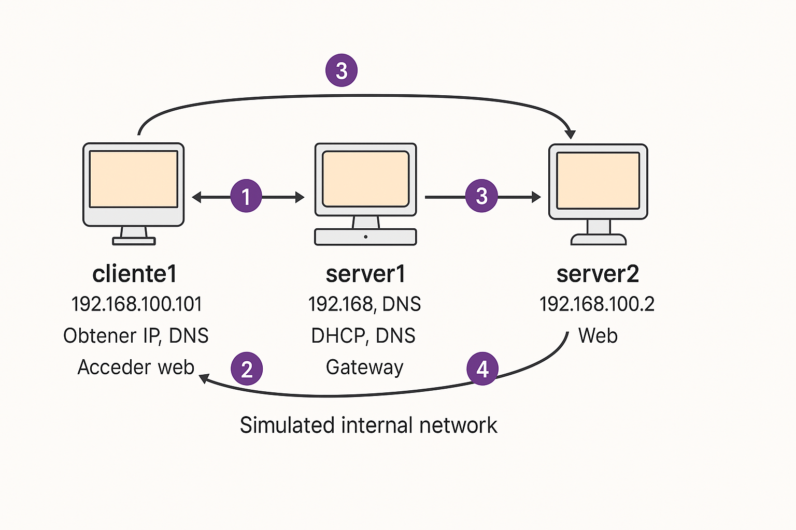

# 📘 Guía Completa (Parte 4): Configurar VirtualHost y Dominio javi.es en Apache (Desde Paso 13)

Esta es la cuarta parte de la guía, a partir del paso 13 según el PDF del profesor. Aquí configuramos un segundo servidor (`server2`) que alojará un nuevo dominio (`javi.es`) con Apache y será accesible desde `cliente1`.

---

## 🔧 PASO 13: Clonar server1 para crear server2

1. En VirtualBox, haz clic derecho sobre `server1` → **Clonar**.
2. Usa nombre: `server2`
3. Elige **Clonación completa** ✅
4. Marca "Generar nuevas direcciones MAC"

> 🔁 Esto crea una copia exacta de `server1`, incluyendo Kea, BIND, Apache, etc.

---

## 📶 PASO 14: Asignar IP dinámica a `server2`

Una vez iniciado `server2`, debe recibir una IP por DHCP (por ejemplo `192.168.100.2`). Verifica con:

```bash
ip a
```

### 📌 Ejemplo de salida esperada:
```
inet 192.168.100.2/24 brd 192.168.100.255 scope global dynamic enp0s3
```

---

## 🌍 PASO 15: Configurar Apache para el dominio `javi.es` en `server2`

### 1. Crear directorio raíz del sitio:
```bash
sudo mkdir -p /var/www/javi.es
```

### 2. Crear archivo HTML:
```bash
echo '<h1>Bienvenido a javi.es</h1>' | sudo tee /var/www/javi.es/index.html
```

### 3. Crear configuración del VirtualHost:
```bash
sudo nano /etc/apache2/sites-available/javi.es.conf
```
Contenido:
```apache
<VirtualHost *:80>
    ServerName javi.es
    DocumentRoot /var/www/javi.es
    ErrorLog ${APACHE_LOG_DIR}/javi_error.log
    CustomLog ${APACHE_LOG_DIR}/javi_access.log combined
</VirtualHost>
```

### 4. Habilitar sitio:
```bash
sudo a2ensite javi.es.conf
sudo systemctl reload apache2
```

> ⚠️ Si obtienes un error de que no puede cargar el sitio, revisa los logs de Apache:
```bash
sudo journalctl -xe | grep apache
```

---

## 🧪 PASO 16: Probar desde `cliente1`

### 1. Verifica `/etc/resolv.conf` en cliente1
Debe apuntar al `server2`:
```bash
nameserver 192.168.100.2
```

### 2. Probar con dig y nslookup:
```bash
dig javi.es
nslookup javi.es
```
✅ Debe devolver: `192.168.100.2`

### 3. Abrir navegador Firefox en `cliente1`:
```
http://javi.es
```

✅ Deberías ver el mensaje “Bienvenido a javi.es”

---

## 🛠️ Archivos importantes en `server2`

### `/etc/bind/db.red.clase`
```dns
javi.es.    IN  A   192.168.100.2
```

### `/etc/bind/db.100.168.192`
```dns
2   IN PTR javi.es.
```

---

## 🚨 Posibles Errores y Soluciones

| Error | Causa | Solución |
|-------|-------|----------|
| `SERVFAIL` al hacer `dig` | No está definida la zona | Revisa `db.red.clase` y reinicia BIND9 |
| Apache muestra error 404 | No encuentra `index.html` | Verifica ruta `/var/www/javi.es/index.html` |
| Firefox no carga javi.es | DNS incorrecto | Asegúrate que `cliente1` tenga `nameserver 192.168.100.2` |
| `no servers could be reached` | IP mal configurada | Ejecuta `sudo dhclient -v enp0s3` en cliente1 |

---

## 🧾 Explicación de Comandos y Archivos

| Comando / Archivo | Función |
|------------------|---------|
| `a2ensite` | Habilita un sitio en Apache |
| `/etc/apache2/sites-available/` | Donde se configuran los dominios virtuales |
| `systemctl reload apache2` | Recarga configuración sin reiniciar el servicio |
| `dig`, `nslookup` | Prueban resolución DNS |
| `db.red.clase` | Zona directa DNS |
| `db.100.168.192` | Zona inversa DNS |

---

## 💡 Tips Útiles

- 🧠 **Dominios como `javi.es`** no son reales. Solo funcionarán dentro de tu red interna.
- 🔁 Asegúrate de reiniciar BIND9 después de editar archivos de zona:
```bash
sudo rndc reload
```
- 🛜 Usa `ping javi.es` para probar si hay conexión TCP/IP.
- 🖥️ Firefox en `cliente1` no abrirá `javi.es` si DNS no está bien configurado.

---

## ✅ Resultado Esperado

Desde `cliente1`:
- `dig javi.es` devuelve `192.168.100.2`
- Firefox abre correctamente `http://javi.es`





¡Servidor web funcional con dominio personalizado en red interna logrado! 🚀

¿Listo para seguir con el paso 17 del PDF del profesor? 😄

